# Batch 1 figures ? preliminary, n=10 per control

These are the unchanged prepared analyzer outputs. Batch 1 is a partial cohort (30/300 matches), descriptive only. Wilson 95% intervals have a small denominator of 10 per control; no confirmatory paired tests were run.

Figure 07 uses the frozen generic PROVIDER_FAILURE stop bucket: its Stepwise 6 AP are entirely request-limit-denied AP, not actual provider-failure AP. Actual provider-failure AP is Strict 5, Bounded 3, Stepwise 0. See batch-1-report.md for the disjoint adjustment.

## 01-win-rates

[SVG](plots/01-win-rates.svg)

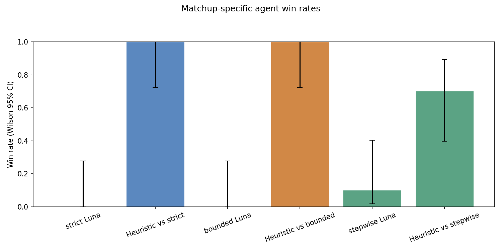

## 02-efficiency-provider_requests

[SVG](plots/02-efficiency-provider_requests.svg)

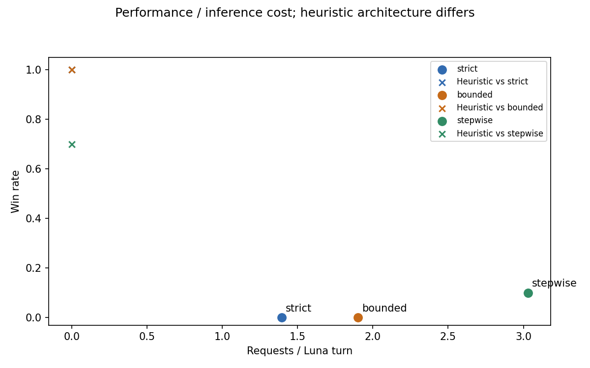

## 03-efficiency-total_tokens

[SVG](plots/03-efficiency-total_tokens.svg)

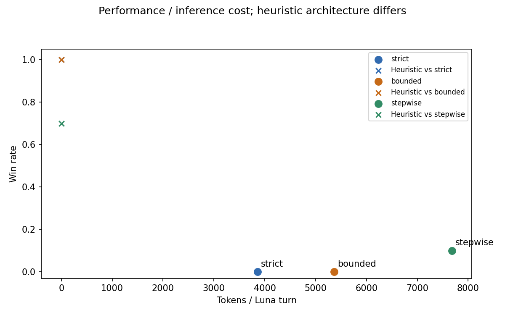

## 04-efficiency-backend_thinking_seconds

[SVG](plots/04-efficiency-backend_thinking_seconds.svg)

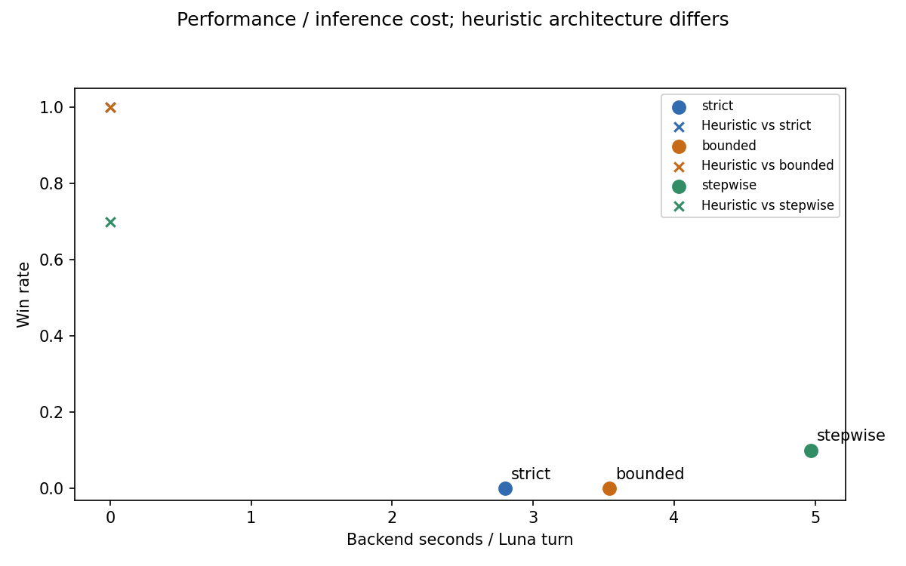

## 05-match-length

[SVG](plots/05-match-length.svg)

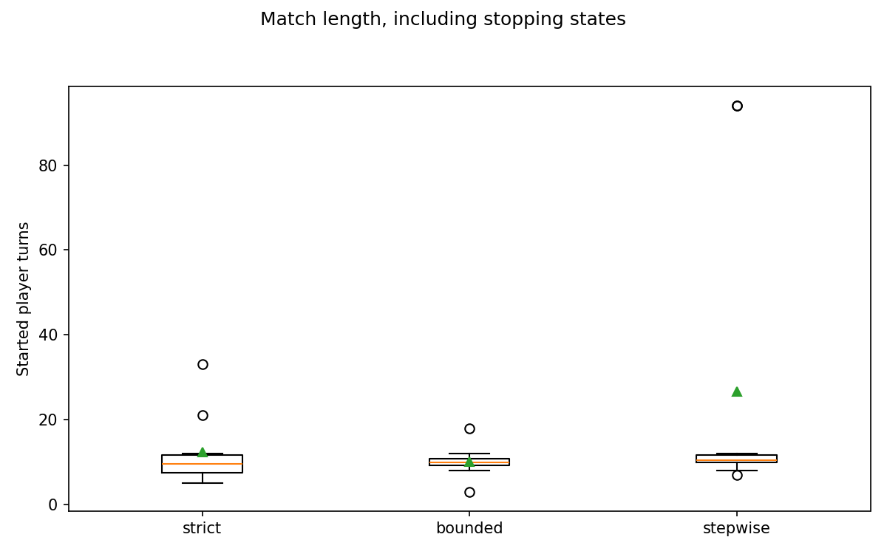

## 06-failure-ap

[SVG](plots/06-failure-ap.svg)

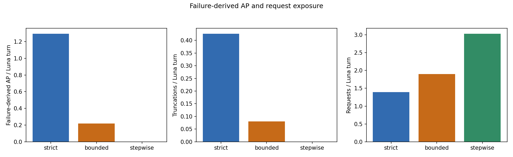

## 07-stop-reasons

[SVG](plots/07-stop-reasons.svg)

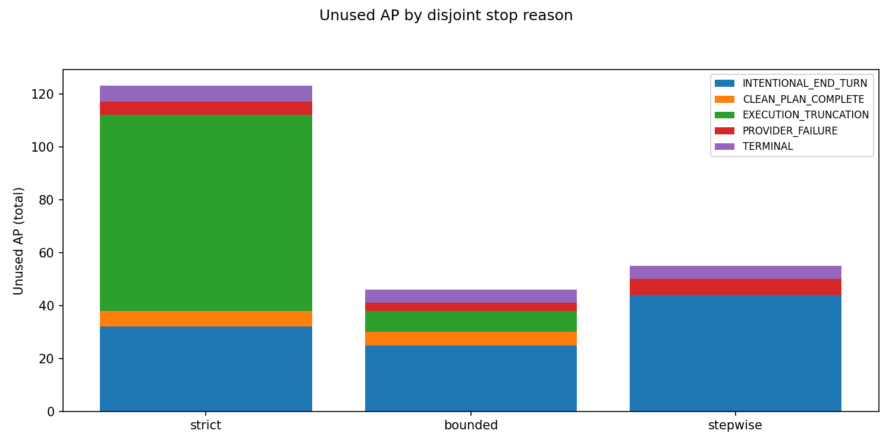

## 08-bounded-recovery

[SVG](plots/08-bounded-recovery.svg)

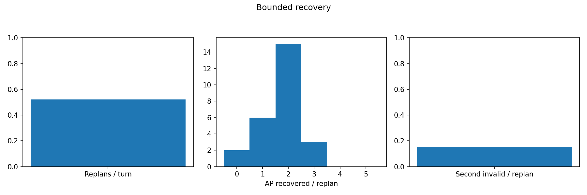

## 09-static-repair

[SVG](plots/09-static-repair.svg)

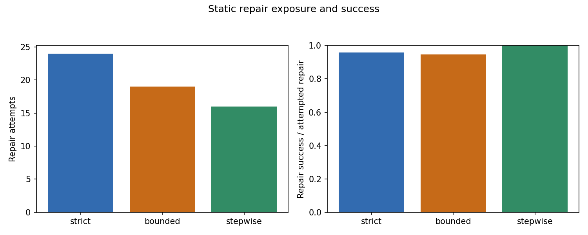

## 10-side-outcomes

[SVG](plots/10-side-outcomes.svg)

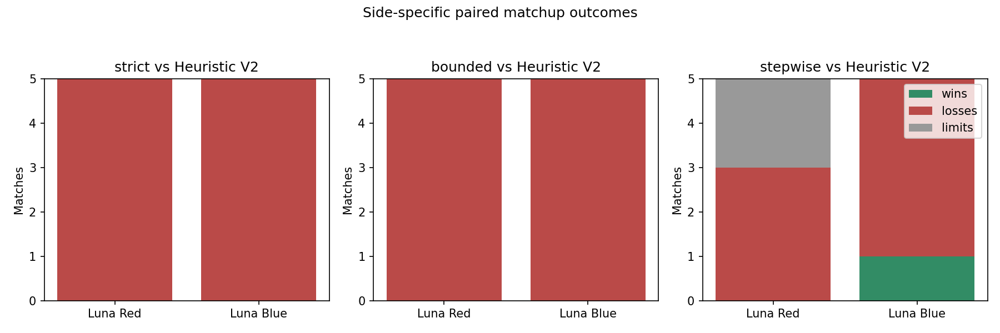

## 11-reliability-frontier

[SVG](plots/11-reliability-frontier.svg)

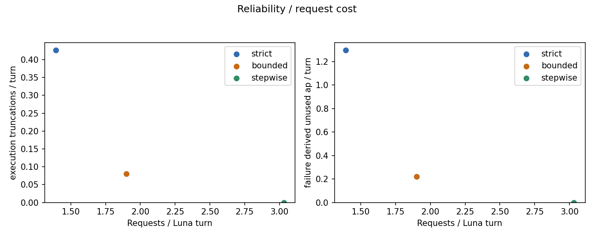
